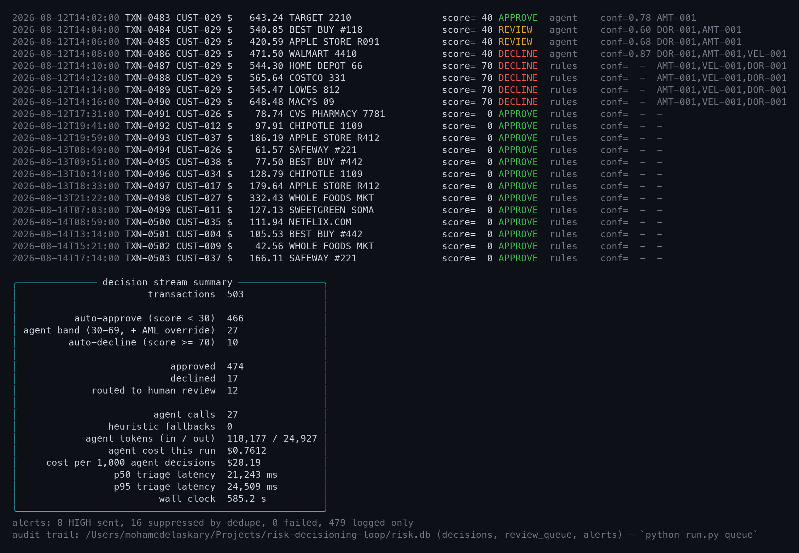
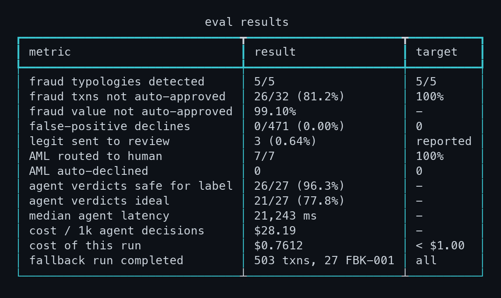
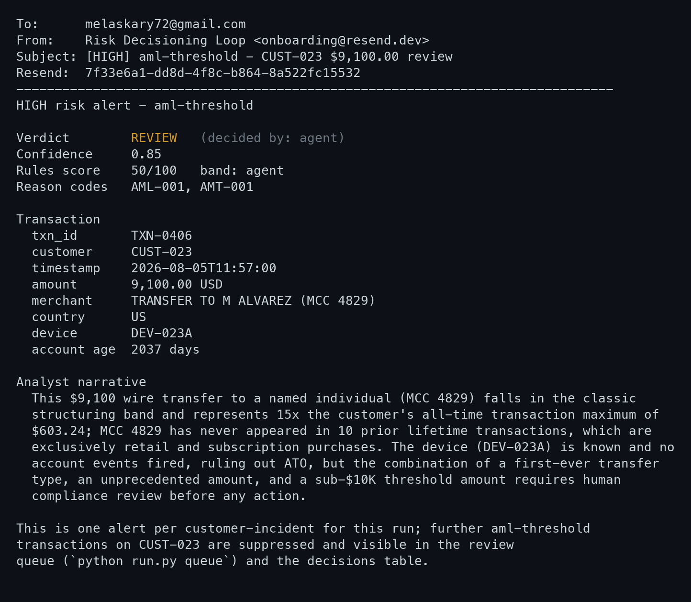

# risk-decisioning-loop

A miniature AI risk decisioning engine over a transaction stream. Deterministic
rules score every transaction and decide the extremes on their own; a Claude
triage agent with tool access investigates only the ambiguous middle band, the
slice where analyst time actually goes; exceptions route to a human review
queue; severity-gated alerts fire once per incident rather than once per
transaction. Every decision, whichever layer made it, is a row in SQLite with
its score, reason codes, narrative, latency and cost. The whole loop is scored
against seeded ground truth by a committed eval, including a run with the API
key removed to prove it still decides safely when the model is unavailable.

```
stream -> rules -> {approve | decline | agent} -> {approve | decline | review queue} -> alerts
```

```
                            503 synthetic transactions, replayed in timestamp order
                                                  |
                                                  v
                                   +------------------------------+
                                   |   RULES  (engine/rules.py)   |
                                   |   9 pure functions, 0-100    |
                                   +------------------------------+
                                                  |
                  +-------------------------------+-------------------------------+
                  |                               |                               |
             score < 30                      score 30-69                     score >= 70
            (466 txns)                       (27 txns)                        (10 txns)
                  |                               |                               |
                  |                    any AML code, any score                    |
                  |                    --> forced into this band                  |
                  v                               v                               v
             AUTO-APPROVE          +--------------------------------+        AUTO-DECLINE
                  |                |  TRIAGE AGENT (Claude, 2 tools)|             |
                  |                |  get_customer_history          |             |
                  |                |  get_related_activity          |             |
                  |                |  strict JSON, retry once       |             |
                  |                +--------------------------------+             |
                  |                     |            |            |                |
                  |                     |     API down / 2 bad parses              |
                  |                     |            v            |                |
                  |                     |   HEURISTIC FALLBACK    |                |
                  |                     |   (engine/fallback.py)  |                |
                  |                     |     score >= 55 -> review               |
                  |                     v            v            v                |
                  |                 approve       review       decline             |
                  |                     |            |            |                |
                  +---------------------+------------+------------+----------------+
                                                     |
                                  enforce_policy: AML -> human, conf < 0.7 -> human
                                                     |
                                                     v
                              SQLite: decisions | review_queue | alerts
                                                     |
                                                     v
                            severity gate -> HIGH only -> Resend, deduped per incident
```

---

## Decision stream



503 transactions across 40 customers replayed in timestamp order. 466 cleared on
rules alone in under a millisecond each, 27 went to the agent, 10 were declined
outright. The agent touched 5.4% of the stream.

---

## Eval results

Every number below is produced by `python evals/run_evals.py`, which joins the
`decisions` table from a real run against the hidden labels in
`data/transactions.jsonl`. Nothing is hand-entered. Full output, including the
per-typology breakdown and the miss list, is committed in
[`evals/results.md`](evals/results.md).



| Metric | Result | Target |
|---|---|---|
| Fraud typologies detected | **5/5** | 5/5 |
| Fraud transactions not auto-approved | **26/32** (81.2%) | 100% |
| Fraud value not auto-approved | **99.10%** ($71,491 of $72,142) | - |
| False-positive declines | **0/471** (0.00%) | 0 |
| Legit transactions sent to review | 3/471 (0.64%) | reported, not targeted |
| AML-code transactions routed to a human | **7/7** (100%) | 100% |
| AML-code transactions auto-declined | **0** | 0 |
| Agent verdicts safe for the label | **26/27** (96.3%) | - |
| Median agent decision | 21.2 s | - |
| Cost of this run | **$0.76** | < $1.00 |
| Cost per 1,000 agent decisions | **$28.19** | - |

**5/5 typologies detected** — card testing, account takeover, structuring,
velocity spike and first-party abuse each produced at least one transaction that
did not silently clear.

**26/32 fraud transactions not auto-approved** — the six misses are the honest
part. Five are the opening authorisations of the card-testing burst, scored
before any velocity rule has the history to fire; a $0.73 charge at an online
merchant is not anomalous on its own. The sixth is a genuine model error, the
second transaction of a dormant-account spree, which the agent approved on
correct reasoning about evidence that was not yet damning.

**99.10% of fraud value not auto-approved** — the six missed transactions total
$650.91 against $72,142 of seeded fraud, because the misses are structurally the
cheap ones and the expensive escalation behind them is declined. This is the
number that matches how fraud loss is actually counted.

**0 false-positive declines** — no legitimate transaction was declined. This is
the metric the design protects hardest: a false decline is a real customer
turned away, and it is not recoverable by an analyst later.

**3 legitimate transactions sent to review (0.64%)** — the cost of that caution,
reported rather than hidden: a $9,500 tuition payment, a new account's first
big-ticket purchase, and a seasonal customer returning after a quiet period.
Review is an analyst-minute spent, not a customer lost.

**7/7 AML transactions routed to a human, 0 auto-declined** — every transaction
that fired AML-001 or AML-002 reached a person, including the legitimate tuition
payment and including the six structuring transactions that scored 90 and would
otherwise have been auto-declined.

**26/27 agent verdicts safe for the label (96.3%)** — "safe" means the verdict
did not do the unsafe thing for that label: fraud not approved, legitimate not
declined. On the stricter reading (fraud declined, legitimate approved, review
where policy mandates it) the agent scores 21/27.

**21.2 s median agent decision, $0.76 for the run** — slow and expensive per
decision, which is exactly why only 5.4% of the stream is allowed to reach it.
Sending all 503 transactions to the agent would have cost about $14.18; banding
first cost $0.76 for the same set of decisions.

### Fallback: the loop with the model switched off

`run_evals.py` re-runs the entire stream in a subprocess with
`ANTHROPIC_API_KEY` removed. It exits cleanly, decides all 503 transactions with
27 heuristic fallbacks (FBK-001), zero agent calls and zero cost.

| Metric | With agent | Heuristic fallback |
|---|---|---|
| Typologies detected | 5/5 | 5/5 |
| Fraud txns not auto-approved | 26/32 (81.2%) | 25/32 (78.1%) |
| False-positive declines | 0 | 0 |
| AML routed to a human | 7/7 | 7/7 |

The loop degrades, it does not break. Recall drops because a heuristic cannot
tell a dormant-account spree from a returning seasonal customer. The two
guarantees that must not depend on a third-party API — no false-positive
declines, and AML always to a human — both hold with the model switched off.

---

## Alerting



8 HIGH alerts sent, 16 suppressed by dedupe. The six structuring transactions on
one customer are one email, not six.

---

## Design notes

- **Rules at the extremes, judgement in the middle.** 94.6% of the stream is
  decided by nine pure functions in under a millisecond, with a reason code an
  auditor can read. The model is spent only on the 5.4% where the rules are
  genuinely ambiguous — which is the same slice a human analyst queue gets today.
- **AML always routes to a human.** Any AML reason code forces the agent band
  regardless of score, and `enforce_policy` will not let an AML transaction end
  as approve or decline. Structuring is a filing question, not a decline button.
  The guardrail reads the codes the *rules* fired, never the codes the model
  returned: during development the agent dropped a code it believed it had
  explained away, and a guardrail that trusts the output it is guarding is not a
  guardrail.
- **Heuristic fallback.** If the API errors or the JSON fails to parse twice, the
  loop completes on a deterministic policy (score >= 55 becomes review) tagged
  FBK-001, and every fallback is logged. Proven by an eval that runs the whole
  stream with the key removed.
- **The decision table is the audit trail.** Every decision — rules, agent or
  fallback — is one row with score, band, verdict, reason codes, the narrative an
  analyst reads, latency, tokens, cost and which layer decided. There is no
  decision path that does not leave a row.
- **Alert dedupe, because an alert nobody trusts fails the same way an
  unactioned one does.** HIGH severity only, deduped by customer plus typology
  within a run. Thirteen card-testing authorisations produce one email.

---

## Quickstart

```bash
python -m venv .venv && source .venv/bin/activate
pip install -r requirements.txt

cp .env.example .env        # add ANTHROPIC_API_KEY, RESEND_API_KEY, ALERT_TO

python data/generate.py     # 503 synthetic txns + account events, seeded labels
python run.py               # replay the stream: rules -> agent -> route -> alert
python run.py queue         # the open human-review queue
python evals/run_evals.py   # score against the hidden labels, write results.md
```

Useful flags: `run.py --no-agent` (rules only), `--dry-run-alerts` (render alerts
without sending), `--only-flagged` (hide the approve lines), `--limit N`.

Requires Python 3.11+. Without `ANTHROPIC_API_KEY` the loop runs entirely on the
heuristic fallback; without `RESEND_API_KEY` alerts are rendered and logged but
not sent. Both degrade cleanly rather than failing.

---

## Scope

The data is synthetic and generated by `data/generate.py`, deliberately: seeding
the fraud myself is what makes the ground truth exact and the eval honest, in a
way that grading against a downloaded dataset with unknown labels would not be.
The whole thing is miniature by design — nine rules, two tools, one model call
per ambiguous transaction, 503 transactions — and was built in an afternoon to
mirror the *shape* of production risk decisioning rather than its scale: rules
and AI agents and human analysts making onboarding, fraud, credit and AML
decisions together, with the numbers to say how well it worked.

Known limits, stated rather than buried: the card-testing burst is not caught
until its 6th authorisation and would need a cross-customer BIN-velocity feature
to catch earlier; the agent's one error in this run was the second transaction of
a spree that had not yet become recognisable as one; and 27 agent decisions is a
small sample to draw confidence intervals from.
